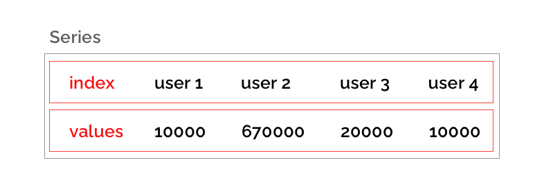
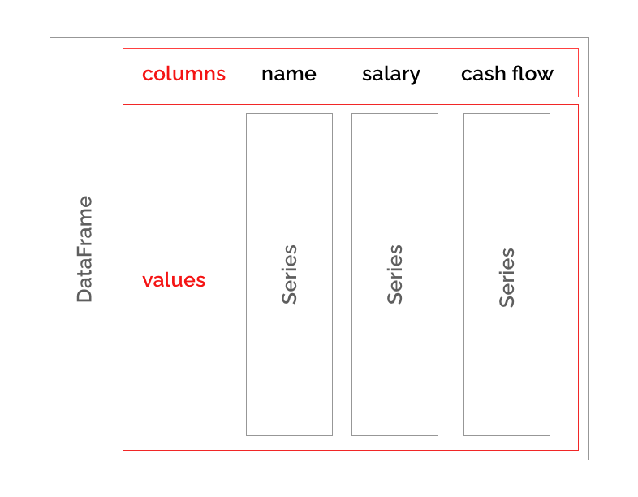

 # L05E02: Data
Vytvořte balíček `data`, který obsahuje moduly `index.py`, `series.py` a `dataframe.py`. U tříd a metod **nezapomínejte na docstringy**.

---

## Třída `Index`
Modul `index.py` obsahuje třídu `Index` sloužící k indexaci libovolné sekvence hodnot.

```python
from data.index import Index


idx = Index(["key 1", "key 2", "key 3", "key 4", "key 5"])
values = [0, 1, 2, 3, 4]

assert values[idx.get_loc("key 2")] == 1
```

Třída obsahuje následující vlastnosti:
* `Index.labels` - seznam klíču (labelů) - nesmí obsahovat duplicity (vyvolá vyjimku `ValueError`) - musí mít alespoň jeden prvek (jinak vyvolá vyjimku `ValueError`).
* `Index.name` - volitelná vlastnost obsahující název indexu, výchozí hodnota na `""`.

Třída obsahuje následující metody:
* `Index.get_loc(self, key)` - přeloží klíč `key` z `Index.labels` na odpovídající index. Pokud není klíč přítomen vyvoláme výjimku `KeyError`.

```python
from data.index import Index


idx = Index(["user 1", "user 2", "user 3", "user 4", "user 5"])

assert idx.name == ""
assert idx.labels == ["user 1", "user 2", "user 3", "user 4", "user 5"]

idx = Index(["user 1", "user 2", "user 3", "user 4", "user 5"], name="users")

assert idx.name == "users"
assert idx.labels == ["user 1", "user 2", "user 3", "user 4", "user 5"]
```

```python
idx = Index(["user 1", "user 2", "user 3", "user 4", "user 5"])

assert idx.get_loc("user 2") == 1
```

---

## Třída `Series`
Modul `series.py` obsahuje třídu `Series`, která uchovává posloupnost hodnot indexovaných dle objektu třídy `Index`.



```python
from data.series import Series
from data.index import Index

# index
users = Index(["user 1", "user 2", "user 3", "user 4"], name="names")

# series indexovaná dle indexu users
salaries = Series([20000, 300000, 20000, 50000], index=users)

assert salaries.values == [20000, 300000, 20000, 50000]
assert salaries.index.labels == ['user 1', 'user 2', 'user 3', 'user 4']
```

Třída obsahuje následující vlastnosti:
* `Series.values` - seznam hodnot uložený v posloupnosti, musí obsahovat alespoň jeden prvek jinak vyvolá `ValueError`.
* `Series.index` - index sloužící k indexaci `Series.values`, musí být stejné délky jako `Series.values` jinak vyvolá `ValueError`. Pokud byla počáteční hodnota `None` vytvoříme index nový, `Index.labels` nastavíme na hodnoty `0` až `n` kde `n` je délka `Series.values`.

Třída obsahuje následující metody:
* `Series.get(self, key)` - pokud `Series.index` obsahuje `key`, vrátí odpovídající hodnotu z `Series.values`, jinak vrací `None`.
* `Series.sum(self)` - sečte všechny hodnoty v posloupnosti, detailní popis níže
* `Series.max(self)` - nalezne maximální hodnotu z posloupnosti, detailní popis níže
* `Series.min(self)` - nalezne minimální hodnotu z posloupnosti, analogicky k max variantě
* `Series.mean(self)` - vypočítá aritmetický průměr, detailní popis níže
* `Series.apply(self, func)` - aplikuje libovolnou funkci na prvky posloupnosti, detailní popis níže
* `Series.abs(self)` - vytvoří novou serii, kde všechny hodnotu budou výsledky aplikace funkce `abs()`, detailní popis níže


```python
from data.series import Series
from data.index import Index


users = Index(["user 1", "user 2", "user 3", "user 4"], name="names")

names = Series(["Lukas Novak", "Petr Pavel", "Pavel Petr", "Ludek Skocil"], index=users)
cash_flow = Series([-100, 10000, -2000, 1100], index=users)
salaries = Series([20000, 300000, 20000, 50000], index=users)

assert salaries.values == [20000, 300000, 20000, 50000]
assert salaries.index.labels == ['user 1', 'user 2', 'user 3', 'user 4']

# situace kdy nebude předán index
no_index = Series(["Lukas Novak", "Petr Pavel", "Pavel Petr", "Ludek Skocil"])
assert no_index.index.labels == [0, 1, 2, 3]
```

```python
from data.series import Series
from data.index import Index


users = Index(["user 1", "user 2", "user 3", "user 4"], name="names")

cash_flow = Series([-100, 10000, -2000, 1100], index=users)

assert cash_flow.get("user 1") == -100
assert cash_flow.get("user 1000") is None
```

Dále bude možné provádět jednoduché operace na datech uložených v `Series`. Konkrétně:

### Metoda `Series.max(self)`/`Series.min(self)`
Maximální hodnota v `Series`. Nemusíte ošetřovat datový typ hodnot v posloupnosti.

```python
from data.series import Series
from data.index import Index


users = Index(["user 1", "user 2", "user 3", "user 4"], name="names")
cash_flow = Series([-100, 10000, -2000, 1100], index=users)

assert cash_flow.max() == 10000
assert cash_flow.min() == -2000
```

### Metoda `Series.sum(self)`
Součet hodnot v `Series`. Nemusíte ošetřovat datový typ hodnot v posloupnosti.

```python
from data.series import Series
from data.index import Index


users = Index(["user 1", "user 2", "user 3", "user 4"], name="names")
cash_flow = Series([-100, 10000, -2000, 1100], index=users)

assert cash_flow.sum() == 9000
```

### Metoda `Series.mean(self)`
Aritmetický průměr hodnot v `Series`. Nemusíte ošetřovat datový typ hodnot v posloupnosti. Můžete použít modul `statistics` a funkci `mean()`.

```python
from data.series import Series
from data.index import Index


users = Index(["user 1", "user 2", "user 3", "user 4", "user 5"], name="names")
cash_flow = Series([-100, 10000, -2000, 1100, 100], index=users)

assert cash_flow.mean() == 1820.0
```

### Metoda `Series.apply(self, func)` 
Která aplikuje funkci `func` na všechny prvky `Series` a vrátí `Series` novou (s vypočítanými hodnotami). Původní `Series` nemodifikuje!

```python
from data.series import Series
from data.index import Index


def squared(a):
    """Returns squared number"""
    return a ** 2


users = Index(["user 1", "user 2", "user 3", "user 4"], name="names")
cash_flow = Series([-100, 10000, -2000, 1100], index=users)

result = cash_flow.apply(squared)

assert cash_flow != result
assert result.values == [10000, 100000000, 4000000, 1210000]
```

### Metoda `Series.abs(self)`
Která aplikuje funkci `abs` na všechny prvky `Series` a vrátí `Series` novou. Původní `Series` nemodifikuje! Nemusíte ošetřovat datový typ hodnot v posloupnosti.

```python
from data.series import Series
from data.index import Index


users = Index(["user 1", "user 2", "user 3", "user 4"], name="names")
cash_flow = Series([-100, 10000, -2000, 1100], index=users)

result = cash_flow.abs()

assert cash_flow != result
assert result.values == [100, 10000, 2000, 1100]
```

---

## Třída `DataFrame`
Modul `dataframe.py` obsahuje třídu `DataFrame`, která slouží k reprezentaci tabulky dat. Tabulka je složena ze sloupců (alespoň jeden sloupec, každý sloupec je tvořen instancí třídy `Series`). Sloupce jsou indexovány pomoci instance třídy `Index`.



Třída obsahuje následující vlastnosti:
* `DataFrame.values` - seznam instancí třídy `Series`, reprezentuje hodnoty sloupců, musí obsahovat alespoň jeden prvek jinak vyvolá `ValueError`.
* `DataFrame.columns` - index sloužící k indexaci `DataFrame.values`, musí být stejné délky jako `DataFrame.values` jinak vyvolá `ValueError`. Pokud byla počáteční hodnota `None` vytvoříme index nový, `Index.labels` nastavíme na hodnoty `0` až `n` kde `n` je délka `DataFrame.values`.

Třída obsahuje následující metody:
* `DataFrame.get(self, key)` - pokud `DataFrame.columns` obsahuje `key`, vrátí odpovídající sloupec (`Series`) z `DataFrame.values`, jinak vrací `None`.

```python
from data.series import Series
from data.index import Index
from data.dataframe import DataFrame


users = Index(["user 1", "user 2", "user 3", "user 4"], name="names")

salaries = Series([20000, 300000, 20000, 50000], index=users)
names = Series(["Lukas Novak", "Petr Pavel", "Pavel Petr", "Ludek Skocil"], index=users)
cash_flow = Series([-100, 10000, -2000, 1100], index=users)

data = DataFrame([names, salaries, cash_flow], columns=Index(["names", "salary", "cash flow"]))

assert data.get("salary") == salaries
assert data.get("cash flow").max() == 10000
```

## Lokální testování
Funkčnost řešení ověříte následujícím příkazem:

```bash
pytest
```